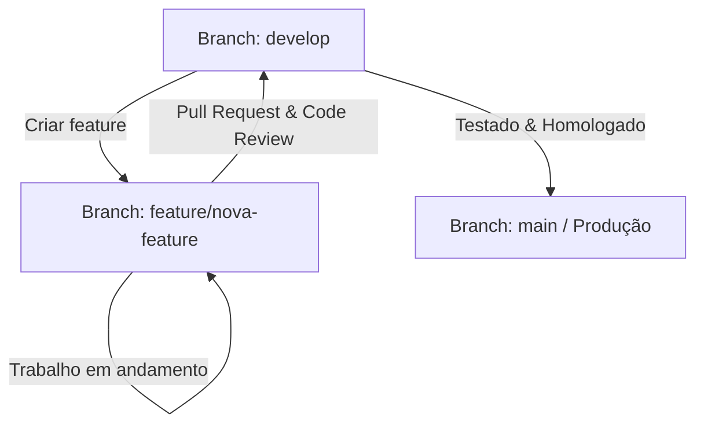

# Governança de Desenvolvimento - Sistema Vigília

Este documento estabelece as regras e o fluxo de trabalho para contribuições e modificações no código-fonte do sistema **Vigília**, visando assegurar estabilidade, rastreabilidade e evitar incidentes severos como marcadores de conflito de merge injetados diretamente em produção.

## 1. Fluxo de Branches

Adotamos uma variação simplificada do Git Flow:

*   **`main` (ou `master`):** Ramificação de produção. Código sempre estável e testado. Deploy automático é disparado a partir deste branch. Pushes diretos são **estritamente proibidos**.
*   **`develop`:** Ramificação de integração de features.
*   **`feature/*`:** Ramificações temporárias criadas a partir de `develop` para desenvolvimento de novas funcionalidades (ex: `feature/fhir-integration`).
*   **`bugfix/*` ou `hotfix/*`:** Ramificações para correção de erros críticos.



## 2. Regras de Aprovação de Pull Requests (PRs)

Para integrar código à branch principal (`develop` ou `main`):

1.  **Revisão por Pares (Code Review):** Todo PR precisa de pelo menos **1 aprovação** de um Engenheiro de Software ou Revisor designado.
2.  **Validação Automática (CI):** O pipeline de CI deve ser executado e concluir com sucesso. Qualquer falha de linter ou testes bloqueia o merge.
3.  **Proibição de Commits de Conflito:** O Git detectará se há marcadores de merge (`<<<<<<<`, `=======`, `>>>>>>>`). Qualquer commit que contenha estas strings será rejeitado na etapa de pré-recebimento (pre-receive hook) e no pipeline de CI.

## 3. Resolução Segura de Conflitos (Passo a Passo)

Caso sua branch esteja desatualizada em relação à de destino, **nunca** resolva conflitos diretamente pela interface web do GitHub se envolver alterações complexas. Siga os passos locais:

```bash
# 1. Vá para a sua branch local
git checkout feature/sua-feature

# 2. Busque as alterações mais recentes
git fetch origin

# 3. Faça o rebase ou merge da branch de destino (ex: develop)
git merge origin/develop

# 4. O Git apontará os conflitos. Abra seu editor, localize os conflitos, decida a versão correta, remova as marcações.
# 5. Adicione os arquivos corrigidos
git add .

# 6. Conclua o processo
git commit -m "chore: resolve merge conflicts with develop"

# 7. Rode os testes locais para verificar se não há SyntaxError
python verify.py
```

## 4. Hooks do Git (Pre-commit)

É obrigatório instalar e configurar o hook de `pre-commit` local para evitar commits acidentais com syntax errors. Adicione a verificação de marcadores de conflitos no seu hook local:

```bash
#!/bin/sh
# verificar se há marcadores de conflito do Git nos arquivos Python e CSS
if git diff --cached | grep -E '^(<<<<<<<|=======|>>>>>>>)' >/dev/null; then
    echo "⚠️ ERROR: Foram detectados marcadores de conflito do Git nos arquivos preparados para commit!"
    echo "Por favor, resolva os conflitos antes de prosseguir."
    exit 1
fi
```
